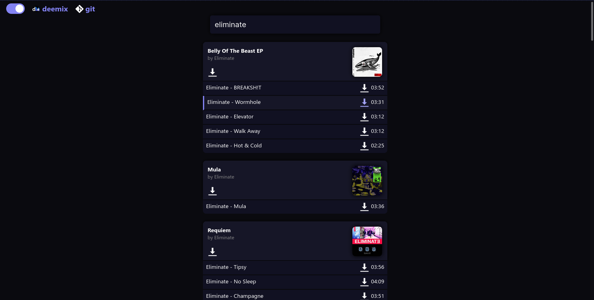
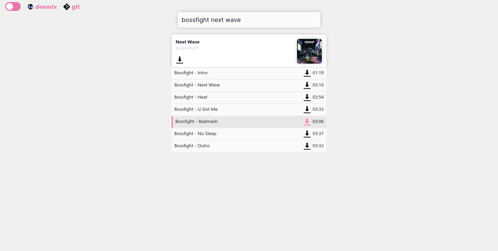

# deemix-web-frontend

a dumb frontend for just getting some got damned songs

this is basically just a wrapper around [deemix](https://deemix.app/), specifically around [deemix-js](https://git.freezer.life/RemixDev/deemix-js). it's main purpose is to serve as an easier, more accessible GUI to the deemix library.

it's intended use is for small groups of people to self-host, and as such there's barely any restrictions to the service and no "official" instance of it. anyone can visit the website, anyone can download a song and a single ARL is shared between all users of a server. there's currently no authentication or similar, but there's plans for an account system.

## screenshots



## usage

1. create an `.env` file from the `.env.example` and enter your deezer ARL (i recommend signing up with an american VPN so less location blocks are enforced and metadata localization stays consistent)

   your arl can be found in the local storage for deezer, as a value conviniently named `arl`

2. (optionally) set a `PORT` value in your `.env` file. (if unset, this will fall back to 4500)

3. `npm install`

4. (optionally) put the service on pm2 like such: `pm2 start src/index.js --name deemix-web-frontend` (or just run it with `node src/index.js`)

### nginx addenum

route `data/` and `public/` through nginx (as serving data through nginx, software optimized for this, would be faster and more secure) and `api/` through localhost. be sure to add websocket-related header setters to your `/api` path:

```nginx
proxy_pass http://localhost:4500/api;
proxy_http_version 1.1;
proxy_set_header Upgrade $http_upgrade;
proxy_set_header Connection "upgrade";
```

your config should look similar to this:

```nginx
location /data {
  root /home/oatmealine/deemix-web-frontend/;
  index test;
  try_files $uri $uri/ =404;
}

location /api {
  proxy_pass http://localhost:4500/api;
  proxy_http_version 1.1;
  proxy_set_header Upgrade $http_upgrade;
  proxy_set_header Connection "upgrade";
}

location / {
  root /home/oatmealine/deemix-web-frontend/public/;
  index index.html;
  try_files $uri $uri/ =404;
}
```

## legal notice

none of the code in this repository reverses, surpasses or otherwise prevents the purpose of Deezer's DRM. all of the related code is done by an [external library](https://gitlab.com/RemixDev/deezer-js/) which has no affiliations with this project. this project simply serves as a GUI or front for said library. **PLEASE ONLY USE THIS PIECE OF SOFTWARE FOR EDUCATIONAL PURPOSES!!** none of the project's authors or contributors encourage piracy, and hold no warranties or responsibilities for use of the software provided.

## attributions & contributors

- [deemix](https://deemix.app/) & [deemix-js](https://git.freezer.life/RemixDev/deemix-js) developers and contributors
- [aether](https://git.oat.zone/aether) for creating the light theme and helping design other parts of the website